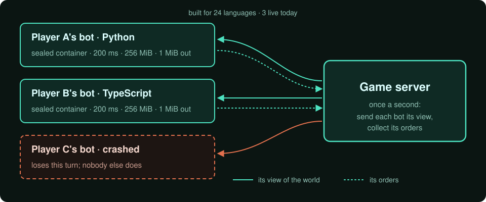
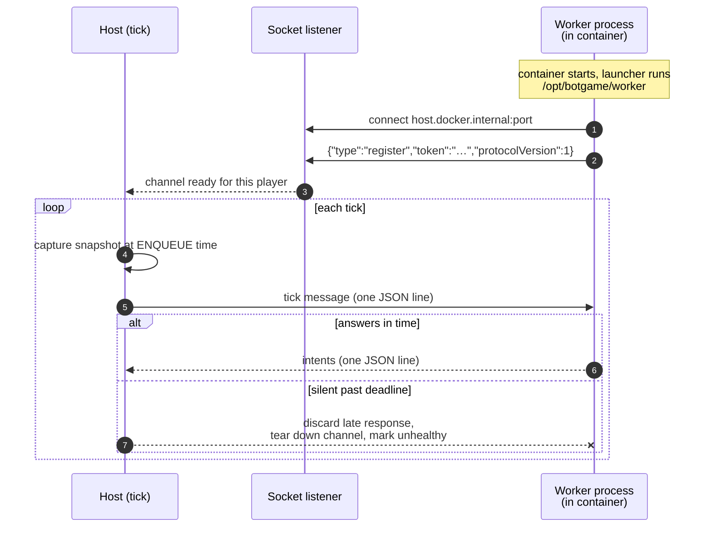

# Running strangers' code safely



Every second, my server runs code written by players it has never met. Each bot runs sealed off on its
own, with hard limits, answers in a few milliseconds, and is sent only what its player is allowed to
see. A bot that crashes or misbehaves loses its own turn, never the game.

- **3 languages running today, 24 prepared** — Python, JavaScript and TypeScript run now; the other
  21 are packaged and one step from running.
- **The same limits in every language** — cut off after 200 ms, with capped memory and output, so no
  language has an edge; unused time is banked, which rewards efficient code.
- **Bots stay loaded** — each answers in 1–5 ms, down from 50–100 ms.
- **Nothing private leaks** — tests check exactly what each player receives, not what the screen
  shows.

---

## One contract for 24 languages

A player uploads a bot, and the sandbox has to assume it might be Haskell. It might allocate until the
box swaps, fork until the process table is full, block on a socket forever, or return 400 MB of
stdout. The engine calls it once per second, takes whatever it produced, and does it again — while
another player's bot does something else wrong in parallel. So the host does not know the language,
the host owns every timeout, and failure is per player.

bash · C · C++ · C# · F# · Clojure · Go · Groovy · Haskell · Java · JavaScript · Kotlin · Lua ·
OCaml · Perl · PHP · PowerShell · Python · R · Ruby · Rust · Scala · Swift · TypeScript

75 Docker images across the version matrix — Python alone spans 3.8 to 3.13, Rust four versions,
Java four. A language is a **descriptor plus a command builder**, registered into DI. Nothing in the
tick path branches on which one it is.

Python, JavaScript and TypeScript run on the live persistent-worker protocol today. The other 21 have
images and build pipelines; each is one worker entrypoint away — that port is the work in progress.

```csharp
// src/BotGame.Infrastructure/Sandbox/ILanguageRuntime.cs
public interface ILanguageRuntime
{
    string LanguageName { get; }
    string[] FileExtensions { get; }
    string[] SupportedVersions { get; }
    string DefaultVersion { get; }

    LanguageCapabilities Capabilities { get; }
    LanguageMetadata GetMetadata();
    ResourceLimits GetDefaultLimits();

    IPlayerExecutor CreateExecutor(
        string scriptPath,
        string? version,
        IServiceProvider serviceProvider,
        string? buildArtifactPath = null);   // prebuilt artifact, or null -> compile per tick

    bool CanExecute(string filePath);
}
```

The second seam absorbs the compiled/interpreted split. A language provides up to four command
strings; which ones come back non-null *is* the classification:

```csharp
// src/BotGame.Infrastructure/Sandbox/Docker/Commands/ILanguageCommandBuilder.cs
public interface ILanguageCommandBuilder
{
    string LanguageName { get; }

    /// Compile step for compiled languages. Null for interpreted languages.
    string? BuildCompileCommand(string scriptFileName, string scriptPath);

    /// Build-once compile writing a persisted artifact, for the upload-time pipeline -
    /// distinct from the per-tick temp-dir compile above. Null where there is no recipe yet.
    string? BuildArtifactCompileCommand(string scriptFileName, string artifactPath);

    /// Run step after compilation. Null for interpreted languages.
    string? BuildExecuteCommand(string scriptFileName, string scriptNameWithoutExt);

    /// Entry point for interpreted languages; may combine compile+execute for some compiled ones.
    string BuildEntryPointCommand(string scriptFileName, string scriptNameWithoutExt, string scriptPath);
}
```

Two orchestrators consume that — `InterpretedLanguageOrchestrator` and
`CompiledLanguageOrchestrator`. Compiled bots are built once at upload time into a persisted
artifact, because a Haskell compile does not fit inside a 200 ms budget.

Adding a language means: an image, a runtime descriptor, a command builder, an environment builder,
and a `/opt/botgame/worker` launcher inside the image. It does not mean touching the tick.

## The limits

The limits do two jobs. They keep the cost of a tick predictable as the number of players grows, and
they are part of the game: every language gets the same budget, so the choice of language is not an
advantage, and banked CPU rewards a player whose colony code gets more efficient as it gets more
complex.

Canonical, and enforced per execution:

| Limit | Value | Why |
|---|---|---|
| CPU allocation per tick | 150 ms | The per-player budget; unused time accrues into a bucket |
| Hard kill | 200 ms | The ceiling the soft timeout can never exceed |
| Real-time overhead allowance | 50 ms | Container round-trip is not the player's CPU |
| Memory | 256 MiB | Per execution |
| Max output | 1 MiB | Truncated, not buffered to death |
| CPU bucket cap | 10,000 ms | Burst allowance for pathfinding and planning spikes |
| Max open files | 65,536 | |
| Max processes (per-process `nproc`) | 65,535 for most images; 512 for TypeScript | Deliberately high — see below |
| Processes per container (`PidsLimit`) | 512 | The cap that actually holds |

The soft timeout is derived, not configured: `min(bucketCurrentCpu, hardKillMs)`. A player who has
banked CPU gets more of it; nobody gets past the hard kill.

The CPU bucket is the original Screeps game's idea, and a good one. Unused CPU accumulates, so a bot
that idles for ten ticks can afford one expensive planning tick. It is a soft roof that nudges
players toward better code, not a punishment.

The per-process number is high because the TypeScript image runs `tsc` inside the container, `tsc`
forks aggressively, and a sane process cap made it die with `vfork: Resource temporarily unavailable`
under load. Limits are per-language overridable, and TypeScript carries its own raised process and
file-handle values. That number is not what contains a fork bomb: the container's own PID limit of 512
caps every process in it, and the memory ceiling and the hard kill hold regardless.

## When a bot fails

A failed execution is classified before anything is retried, so the recovery action is named rather
than inferred at the call site:

```csharp
// src/BotGame.Infrastructure/Sandbox/Docker/Execution/ContainerFaultClassifier.cs
public static ContainerFaultDecision Classify(ExecutionOrchestrationResult result)
{
    var errorMessage = result.ErrorMessage ?? result.Exception?.Message ?? string.Empty;

    var isContainerNotRunning = result.Exception is InvalidOperationException invalidOpEx &&
        invalidOpEx.Message.Contains("is not running", StringComparison.OrdinalIgnoreCase);

    // vfork/resource exhaustion during compile or exec: recycle so the next tick gets a
    // fresh process table.
    var isResourceExhaustion =
        errorMessage.Contains("Resource temporarily unavailable", StringComparison.OrdinalIgnoreCase) ||
        errorMessage.Contains("vfork", StringComparison.OrdinalIgnoreCase);

    return new ContainerFaultDecision(
        ShouldRecycle: isContainerNotRunning || isResourceExhaustion,
        IsResourceExhaustion: isResourceExhaustion);
}
```

String-matching a Docker error message is what the platform gives you, so it lives in one classifier
with unit tests over the real message shapes, not in `Contains("vfork")` calls scattered through the
executor. The return type — `readonly record struct ContainerFaultDecision(bool ShouldRecycle, bool
IsResourceExhaustion)` — keeps the two independent facts explicit.

Above that sits the escalation ladder:

- **Timeout** — the late response is discarded, the channel torn down, the worker marked unhealthy.
  The tick does not wait.
- **Crash** — exit code mapped to a player-facing error, written to that player's console, tick
  continues.
- **Repeated failure** — a sliding window over timeout count and failure rate flips the script to
  `DisabledDueToInstability`. The player is told. The engine stops paying for it.
- **Container lost out of band** — detected and recreated on the next execution.

A tick skipped because the worker's channel is missing records its own status,
`InfrastructureUnavailable`, which the auto-disable window does not count as a failure: an
infrastructure blip is never charged to the player. Code that starts and then errors or times out is
still the player's.

## The warm worker

A persistent worker is one long-lived process per player container. It receives a **tick message**
and replies with **intents**. Start-up is paid once, the interpreter and the JIT stay warm, and a bot
can keep in-process caches between ticks without asking the engine for a storage feature. The host in
turn owns liveness, a protocol version, and hanging up on a worker that stops answering.



### The contract

Newline-delimited JSON, one line per message, in both directions. Every message carries
`protocolVersion` so the shape can migrate without guessing.

**Host → worker:**

```json
{
  "protocolVersion": 1,
  "tickNumber": 42,
  "executionId": "guid-string",
  "gameState": {
    "time": 42,
    "memory": "{\"counter\":3}",
    "units": [ { "id": "…", "x": 0, "y": 0, "unitType": "basic", "health": 100,
                 "tags": { "role": "harvester" } } ],
    "structures": [ { "id": "…", "x": 0, "y": 0, "type": "hatchery", "health": 200, "tags": {} } ]
  },
  "constants": { "gatherRange": 2.0, "transferRange": 2.0, "roomGridRadius": 1 },
  "cpuTimeoutMs": 150,
  "deadlineUtc": "2026-01-15T12:00:00.000Z",
  "token": "auth-token-for-api-calls"
}
```

The worker replies with the intents the bot produced. That is the whole surface. Inside the payload:

- **`memory` is an opaque string the engine never parses.** It is the player's blob, owner-private,
  shipped whole each tick. An LLM-written bot can put anything in it without the protocol needing to
  know what.
- **`constants` are sent, not hardcoded.** A worker predicting whether a gather will succeed needs
  the gather range. Shipping it means the prediction can never drift from the server rule. The
  backend stays authoritative for validation regardless.
- **`roomGridRadius` is optional, and its absence means "skip the check".** When it is missing the
  worker does not guess a world extent — a wrong extent reports real ground as wall, and a
  frontier-seeking bot then walks into the void forever. `0` is a legitimate single-room world, not a
  disabled sentinel.

### The snapshot is captured at enqueue

Player scripts are dispatched in parallel, and between scheduling a worker and handing it its message
the tick can advance. State captured at run time would give a slow player state from a tick that is
no longer the one they are computing for, so their intents would apply to a world that has already
moved — non-deterministically, depending on scheduling. So the snapshot is captured when the
orchestrator schedules the execution, before anything advances, and the message carries the state
that belongs to `tickNumber` by construction. The worker never fetches state at run time.

### Two transports, one abstraction

Socket is the default: the host listens on TCP, the worker dials `host.docker.internal` and sends a
one-time register message with a token from its environment. Stdio is the fallback, attaching to the
worker process's stdin/stdout through Docker. The channel manager does not know which it got:

```csharp
// src/BotGame.Infrastructure/Sandbox/PersistentWorker/IWorkerTransportStrategy.cs
/// <summary>
/// Starts a persistent worker for a container and returns a connected line stream.
/// Hides socket-vs-stdio mechanics (env, tokens, connection wait) from the channel manager.
/// </summary>
public interface IWorkerTransportStrategy
{
    Task<IPersistentWorkerStream?> ConnectAsync(
        PlayerId playerId,
        string containerId,
        string workerEntrypointCommand,
        CancellationToken cancellationToken);
}
```

`ConnectAsync` returns `null` rather than throwing: a worker failing to come up is an expected outcome
on a hot path that must not unwind. Channels are cached per player in a `ConcurrentDictionary` and
evicted after an idle-tick threshold, so an inactive colony stops holding a process open. The host
invokes `/opt/botgame/worker` and nothing else; whether that is a shell script exec'ing Python or a
compiled Go binary is the image's business.

### The timeout rule

**The host enforces the deadline. The worker is never trusted to.** `deadlineUtc` and `cpuTimeoutMs`
are in the message so a well-behaved worker can bail out early and return partial work — a courtesy,
not a mechanism. A worker that has wedged cannot report that it has wedged, so the host holds its own
timer, and on expiry it discards any late response, tears down the channel, and marks the worker
unhealthy. The tick proceeds without that player.

## What a player may see

This is a game for programmers. Anything the server sends a client, a player can read with a proxy or
a debugger — so the boundary is the server, and a value a player may not know is never serialised for
that player.

Every full-state path — the per-tick broadcast, the seed sent when a client connects, and the REST
endpoint a client calls to resynchronise — goes through the same per-player projection. The
controller takes the player from the authenticated principal and nowhere else, never from an id the
client supplies:

```csharp
// src/BotGame.Presentation/Controllers/WorldController.cs
[HttpGet("fullstate")]
public async Task<IActionResult> GetFullState(CancellationToken ct)
{
    if (!User.TryGetPlayerId(out var playerId, out var forbidden))
        return forbidden!;

    var delta = await _playerFullState.BuildForPlayerAsync(playerId, ct);
    if (delta == null)
        return NotFound("World not found.");
    // …
}
```

Owner-private unit tags — `role: scout`, `mine: 1,2,3` — are not on the broadcast unit DTO at all, so
there is nothing to forget to strip. A regression test serialises a tagged unit and asserts on the
JSON itself:

```csharp
// tests/BotGame.Infrastructure.Tests/Network/UnitToDtoMappingTagsTests.cs
[Fact]
public void ToUnitDto_TaggedUnit_DoesNotLeakTagsOnBroadcastWire()
{
    var unit = NewUnit();
    unit.ReplaceTags(new Dictionary<string, string> { ["role"] = "scout", ["mine"] = "1,2,3" });

    var dto = UnitToDtoMapping.ToUnitDto(unit);
    var json = JsonSerializer.Serialize(dto, JsonOptions.Default);

    using var doc = JsonDocument.Parse(json);
    Assert.False(
        doc.RootElement.TryGetProperty("Tags", out _),
        "Broadcast UnitDto must not carry owner-private tags — they leak to any client that can see the unit.");
}
```

### The line, stated once

| | Public, always answerable | Fogged |
|---|---|---|
| Terrain type | everywhere, explored or not | — |
| Basic resource nodes | position and the map's generated amount | the live amount at a node you have seen |
| Units, structures, enemies | — | only what you can currently see |

**The static world is public; the dynamic world is fogged.** The generated amount of a resource is a
constant of the map and leaks no activity; the *live* amount stays fogged, because a draining patch
would broadcast "someone is mining over there". One path is knowingly ungated: the endpoint that
serves room terrain and the world seed is not projected per player. Terrain is public by the rule
above, so it leaks nothing a bot cannot already ask for.

### Two credentials, two trust levels

A human and a bot container are different principals, so they authenticate differently:

- **A human session** uses an opaque bearer token.
- **A worker container** uses a JWT that expires after 60 minutes and is re-issued with the tick
  messages its worker receives.

They are two named ASP.NET authentication schemes behind two policies, not one token type with a
flag: a credential that only ever acts for one colony's bot must not stand in for a person. Both
schemes emit the same player-id claim, so every downstream check reads the player the same way
whichever door the request came in by.

### One ownership guard, fail-closed

"Does this player own this unit?" is answered in one place, in Domain, fail-closed on both sides:

```csharp
// src/BotGame.Domain/Common/Aggregates/Ownership.cs
public static bool IsOwnedBy(this IOwnable owned, PlayerId? playerId)
{
    ArgumentNullException.ThrowIfNull(owned);
    return playerId is not null && owned.OwnerId is not null && owned.OwnerId == playerId;
}
```

With value objects and records, `null == null` is `true`, so a bare `OwnerId != playerId` would call
an unowned aggregate "owned" by an absent caller. The explicit null checks close that. The id type
also has an implicit conversion to `Guid` that throws on null, so the "obvious" rewrite trades a silent
accept for an exception; the guard's doc comment says so, next to the code.

### A placeholder key that cannot ship

The committed development JWT key is a placeholder, and a startup guard makes sure it can never be the
deployed one:

```csharp
// src/BotGame.Presentation/Configuration/JwtSecretGuard.cs
public const string PlaceholderMarker = "ChangeInProduction";

public static void Validate(string? jwtSecretKey, bool isDevelopment)
{
    if (isDevelopment) return;

    var secret = jwtSecretKey ?? string.Empty;
    if (secret.Contains(PlaceholderMarker, StringComparison.OrdinalIgnoreCase))
    {
        throw new InvalidOperationException(
            "Game:PlayerApi:JwtSecretKey is still the development placeholder. A non-Development " +
            "deployment must set a strong secret via the Game__PlayerApi__JwtSecretKey " +
            "environment variable.");
    }
}
```

A test reads the *committed* `appsettings.json` and asserts the placeholder marker is still present,
so swapping the dev placeholder for a real-looking secret makes the test fail and say why. The guard and the test cover
opposite directions of the same mistake.

## Decisions behind this

### Untrusted code goes in a container

<!-- budget:card max=150 -->
> In the context of running players' arbitrary code every tick, facing crashes, runaway memory and
> language sprawl, I chose a Docker sandbox per player over in-process runtimes, accepting the cost
> of a container round-trip.

| | |
|---|---|
| **Problem** | The first executor ran bots inside the server: WebAssembly, Python.NET and a V8 host. |
| **Options** | In-process runtimes (rejected: one bad bot shares the server's process) · Judge0 or Piston (rejected: built for stateless jobs, not a per-tick call against a frozen snapshot) · **containers** |
| **Chosen** | One container per player, with a CPU budget, a hard kill, a memory ceiling and an output cap. |
| **Outcome** | One contract across 75 images, and failures that stay per-player. |
| **Lesson** | Isolation you get from the operating system beats isolation you maintain yourself, three runtimes over. |
<!-- /budget -->

### A warm worker per player, on by default

<!-- budget:card max=150 -->
> In the context of a 1,000 ms tick shared by every player, facing 50–100 ms per `docker exec` and a
> fresh server that ran nothing while logging errors nobody read, I chose one persistent worker per
> player, required at start-up, accepting that the host owns liveness and a protocol version.

| | |
|---|---|
| **Problem** | Start-up plus a round-trip per player per tick was most of the budget, and the default configuration ran no scripts. |
| **Options** | Exec per tick (rejected: cost) · warn and continue (rejected: silent failure) · **a warm worker, required at start-up** |
| **Chosen** | Versioned JSON lines over TCP, stdio fallback; any validator error or missing image mapping stops the server. |
| **Outcome** | ~1–5 ms per player per tick; no silent no-op servers — and a language without a worker cannot run: 21 of 24 today. |
| **Lesson** | Read state when work is scheduled, not when it runs. |
<!-- /budget -->

### Compile at upload, not per tick

<!-- budget:card max=150 -->
> In the context of compiled languages inside a 1,000 ms tick, facing a recompile on every execution,
> I chose to build once at upload into a persisted artifact, accepting a build state the project must
> pass before it can run.

| | |
|---|---|
| **Problem** | Compiled bots were rebuilt inside the run container every tick, which blew the budget. |
| **Options** | Compile per tick (rejected: cost) · **build once** |
| **Chosen** | A `Built` status; activation requires it; success means a non-empty artifact, not just compiler exit 0. |
| **Outcome** | Compile cost paid once per upload. |
| **Lesson** | "Exit code 0" is a claim; the artifact is the evidence. |
<!-- /budget -->

### The server is the trust boundary

<!-- budget:card max=150 -->
> In the context of a game for programmers, facing private data on the wire that the client merely
> did not render, I chose per-player projection on the server over filtering in the client, accepting
> that every full-state path must go through it.

| | |
|---|---|
| **Problem** | Owner-private unit tags were broadcast to rivals; reconnecting shipped the whole world. |
| **Options** | Client-side filtering (rejected: readable with a proxy) · **server-side projection** |
| **Chosen** | Private fields removed from the wire DTO; full-state keyed on the authenticated player only. |
| **Outcome** | Regression tests assert on the serialised bytes, not on what renders. |
| **Lesson** | Client-side filtering is decoration, not a boundary. |
<!-- /budget -->

### The static world is public

<!-- budget:card max=150 -->
> In the context of fog of war, facing scouts that walked into mountains forever and colonies whose
> economy depended on scouting luck, I chose a public board over fogging everything, accepting that
> exploration no longer finds resources.

| | |
|---|---|
| **Problem** | Fogged terrain made unexplored walls and open ground indistinguishable; hidden resources made spawning a dice roll. |
| **Options** | Fog everything (rejected) · **terrain and resource positions public, everything dynamic fogged** |
| **Chosen** | Generated amounts public; live amounts, units and structures stay fogged. |
| **Outcome** | Scouts stopped wedging; colonies stopped depending on luck. |
| **Lesson** | Hiding what the engine already reveals protects nothing. |
<!-- /budget -->

---

[← back to the front page](../README.md)
