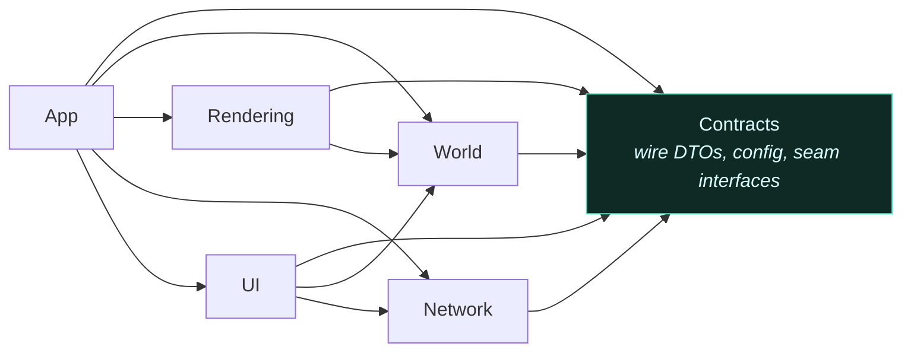

# The game and its world

I rebuilt the look of this 3D world four times without changing the game's rules, because the game
runs on the server and the app you watch it in only draws what the server sends. Every player's
colony — its base and its creatures — lives here, and you can watch the players' bots steer them. A
new look could even be built by someone else.

- **One seamless world** — generated as one landscape, with no visible seams.
- **Creatures whose legs are placed by code** as they walk.
- **Watch from a browser**, with nothing to install.
- **Built with four different game tools**, November 2025 to February 2026, before settling on Unity
  3D.

---

## Four engines

This is my first game, built solo, and I did not know what I wanted it to look like. So I built it
four times, mostly to find out.

### Godot, 2D hexagons — November 2025

*Godot, 2025-11-06. The first world: one hexagonal room, generated rock veins, one unit.*

A minimal Godot frontend over a hexagonal room. It lasted six days; the commit that ended it is titled
"We gonna go to Unity". The migration plan written at the time names why: C# on both sides of the
wire, full 3D lighting, an orthographic camera for a strategy-game view, and the asset store.

### Unity, still 2D hexagons — November 2025

*Unity, 2025-11-15. The same hexagonal room, now rendered by a client connected to the live server.*

The Unity 2D client kept the hexagonal grid and grew it: by the end of November there were 49
hex-named files across the backend and the client.

### Unreal, procedural 3D — December 2025 to February 2026

*Unreal Engine, 2025-12-07. Procedurally placed trees on generated terrain.*

Then I went looking for a look. Unreal's procedural content framework could fill a landscape with
forests and rock that Unity 2D could not, and the move to it deleted all 49 hex files. It did not last
either: Unity can build for the browser and Unreal no longer can, and Unreal was too much engine for
one person learning to make a first game.

### Unity 3D — from February 2026

*Unity 3D (URP), 2026-05-22. Eroded terrain on the rectangular room grid.*

Five days after the Unreal commit, a Unity 3D project on the Universal Render Pipeline replaced it.
That is the client today: Unity 6, URP, and the six modules described below.

## The client

The Unity client is a **visualiser**. It fetches the room once over REST, then consumes a
zlib-compressed WebSocket delta stream. It applies spawn and unit commands ahead of the server for
responsiveness, and the next delta confirms or corrects them. It never decides gameplay state — if the
client and the server disagree, the client is wrong by construction.

That is what made four clients survivable: none of them owned the game. The simulation has lived in
its own backend project since the first commit, and a client renders what it is sent. Each engine
change still meant real backend work — those commits touched between 33 and 321 backend files, as
data shapes and world generation changed — but the game's rules were never the thing being rewritten.
It is also what makes the browser view cheap: a different renderer over the same feed, not a second
implementation of the game.

The client is six assemblies with a compile-time-enforced dependency graph:

Contracts is a leaf. When Rendering needs something the app layer owns, it depends on an interface
in Contracts — `IUnitProximityQuery`, `IWorldStateApplier`, `IEntityPanelDataProvider` — rather than
reaching upward. There is no `InternalsVisibleTo` anywhere; crossing a boundary requires being
`public`, which makes every crossing deliberate and visible in review.

Unity does not enforce architecture for you. Assembly definitions are the one mechanism that turns a
layering intention into a compile error, which is why the client has six of them and not one
`Assembly-CSharp`.

## The map

**Hexagons, then rectangles.** Hexagons went with the Unreal move. When the world came back to Unity
it was a grid of rectangular rooms, and a later spec locked that in: the world is rectangles, and the
hexagonal coordinate machinery does not come back. The last piece of it — an interface of axial hex
coordinates with no implementation and no caller — was deleted in September.

**Rectangles, then no seams at all.** Gameplay terrain is a pure function of global coordinates, with
no per-room overlay. One erosion pass runs over the whole field and the result is sliced into rooms
afterwards, so water flows across what used to be borders. At a single-room world the output is
byte-identical to the old one, so the change could not quietly alter a map that already existed.

Rooms are still there, but only inside the engine: a compute partition for occupancy, pathfinding and
fog, invisible to players (see [the domain model](what-happens-every-second.md#the-domain-model)).

**One grid for bots.** Bot coordinates are global and continuous, and a bot never learns that rooms
exist. The bot API is flat `(x, y)`: the game is top-down and collision only uses the ground plane.
The engine's internal position type stays 3D for rendering, and the reason it must never be used for
gameplay is written into the type itself.

## The look

The design has two pillars, and the first is about feel: the game is something you drop into and
watch. The rule written for it:

> **Visual feel beats engine throughput** — a 2 s tick that interpolates beautifully beats a 500 ms
> tick that snaps.

Unit movement was slowed to a tenth of its original pace for watching, then raised to three tenths.
The browser watch client exists because the easiest way to watch is not to install anything.

*2026-05-23. Early volumetric fog over the 3D terrain.*

*2026-06-04. A colony's clearing: what one player can see, and the dark they cannot.*

The fog of war took four stages to look right. How it works is on
[What happens every second](what-happens-every-second.md#fog-of-war).

**Flat, before any fog or lighting** — the terrain mesh and a small visible clearing around the
colony. Correct, and dead.

**Volumetric fog, over-tuned** — two fog layers doing their job and then some. Atmospheric, and
close to unplayable: you cannot see your own units.

**The three states, with soft borders** — unseen, explored, and visible, blended rather than
stencilled, with the fog height ramp driven by distance from vision.

**Tuned** — the visible region reads clearly, explored terrain stays legible, and the unseen world
recedes without becoming a black hole.

And the creatures that live in it:

*Creature model, 2026-05-03.*

## Decisions behind this

### Terrain is a function of global coordinates

<!-- budget:card max=150 -->
> In the context of a world stored as rooms, facing discontinuities wherever a room's generation
> met its neighbour's, I chose terrain as a pure function of global coordinates over per-room
> overlays, accepting erosion run over the whole field.

| | |
|---|---|
| **Problem** | Anything generated per room had an edge at the seam. |
| **Options** | Per-room overlays (rejected: seams) · **one global function, sliced into rooms** |
| **Chosen** | No room-local overlay; erosion runs once over the whole field. |
| **Outcome** | A seamless world; byte-identical output at a single room. |
| **Lesson** | Keep the partition in the engine and out of the world. |
<!-- /budget -->

### One coordinate grid for bots

<!-- budget:card max=150 -->
> In the context of players writing bots, facing an LLM's obvious "move east until `x > 100`"
> silently breaking at every room seam, I chose one continuous global grid over room-local
> coordinates with a `room=` parameter, accepting negative coordinates in every runtime.

| | |
|---|---|
| **Problem** | Bot coordinates reset at every room boundary. |
| **Options** | Room-local coordinates plus `room=` (rejected: seams leak into bot code) · **one global, continuous `(x, y)`** |
| **Chosen** | Global coordinates; bots never learn that rooms exist; the bot API is flat 2D. |
| **Outcome** | Bot code works across the whole world. Negative coordinates exposed a truncation bug — Python's `int()` and JavaScript's `Math.trunc` put every negative non-integer coordinate one cell off — fixed by flooring first. |
| **Lesson** | A runtime that decomposes a coordinate needs a parity test against the server, not a comment claiming parity. |
<!-- /budget -->

---

[← back to the front page](../README.md)
