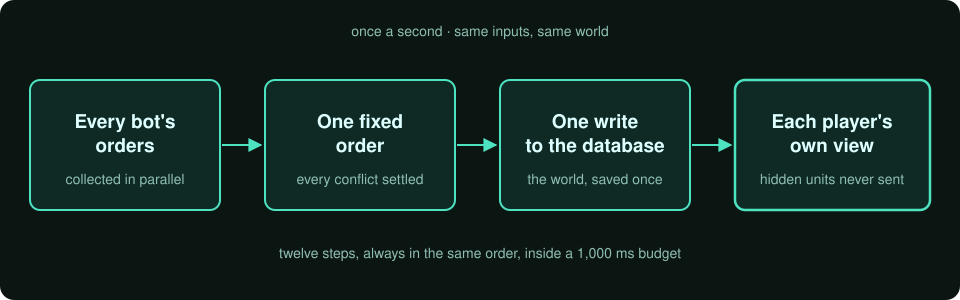
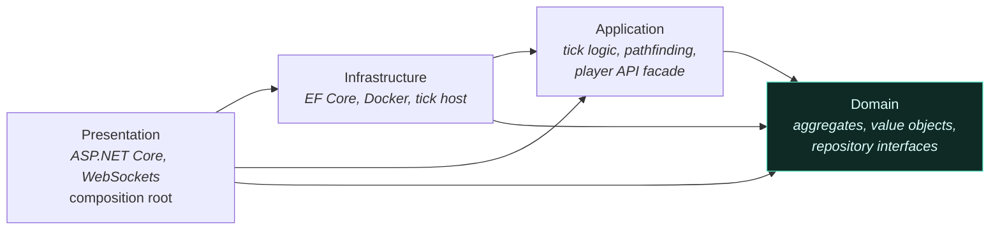
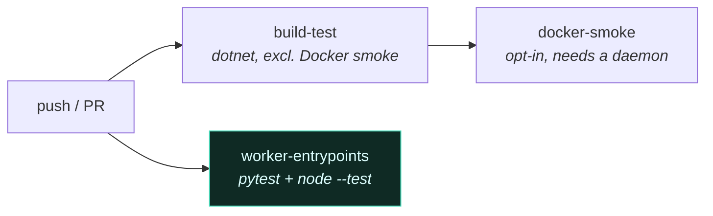

# What happens every second



Once a second, the server collects every bot's orders, settles every conflict in a fixed order, saves
the world in one write, and sends each player only their own view of it. The same inputs always
produce the same world, and tests run it twice to prove it. Speed tests measure every part.

- **Twelve steps, always in the same order** — run every bot, apply its orders, update the world,
  work out what each player can see, save once — inside a 1,000 ms budget.
- **Same inputs, same world** — tests run the same second twice and check the results match exactly.
- **Players only see what their units see** — hidden enemy units are never sent.
- **Measured, not guessed** — when a rewrite made planning unit moves 13× slower at 5,000 units, the
  speed tests caught it, and it was brought back from 2,821 ms to 1,409 ms.

---

## The layers



The rule that matters: **Domain depends on nothing.** No EF, no MediatR, no IO, no framework at all.
It is 8,000 lines of aggregates, value objects and domain services that could be compiled against any
host. Everything above it may depend downward and never upward, which is what makes the domain
testable without a database and keeps game rules out of persistence code.

Presentation is the composition root and the only authoritative host: it owns the tick loop, the
database, the HTTP API and the WebSocket broadcast. There is no second writer.

| Project | Owns | Size |
|---|---|--:|
| `BotGame.Domain` | Aggregates, value objects, domain services, repository interfaces | 116 files |
| `BotGame.Application` | Tick reconciliation, pathfinding, vision, the player API facade, CQRS handlers | 292 files |
| `BotGame.Infrastructure` | EF Core, Docker execution, persistent workers, tick hosting, broadcast | 442 files |
| `BotGame.Presentation` | HTTP API, WebSockets, DI composition, startup validation | 85 files |

## The loop

```mermaid
sequenceDiagram
    autonumber
    participant H as Tick host
    participant S as Script scheduler
    participant C as Docker containers
    participant R as Reconciliation
    participant DB as Database
    participant W as WebSocket clients

    H->>S: resolve runnable players (deterministic order)
    S->>S: capture per-player snapshot at enqueue time
    S->>C: tick message per player (parallel)
    C-->>S: intents, or timeout / crash
    Note over S,C: a player that times out is dropped from<br/>this tick only; the others are unaffected
    S->>R: all intents for this tick
    R->>R: pathfind, resolve traffic conflicts, apply rules
    R->>DB: one batched flush
    DB-->>H: persisted state
    H->>W: per-player visibility-projected delta
```

The tick runs in lockstep: it awaits every script, and the 200 ms hard kill bounds the wait. A
player's script runs once per tick against a frozen snapshot and returns intents — "move toward here",
"gather that" — and the engine decides what actually happens. Intents apply on the tick they were
computed for; there is no background queue and no drain-results-next-tick.

## Twelve phases

The tick is twelve `ITickPhase` implementations running in a fixed sequence over a shared
`TickPipelineState`. A phase returning `Halt` stops the pipeline and must have set the result.

```csharp
// src/BotGame.Infrastructure/Services/Tick/Pipeline/ITickPhase.cs
public interface ITickPhase
{
    /// <summary>
    /// True on the first phase whose per-action command-handler saves must be deferred into the
    /// single end-of-tick flush. The orchestrator opens a mutation batch on reaching this phase and
    /// holds it open through the rest of the pipeline, so handler SaveChanges calls stage rather
    /// than flush mid-tick — keeping the change-tracker set intact for the phases that overlay it
    /// (hatchery regen, visibility). Phases before it (first-run spawn) still flush immediately, so
    /// their writes are visible to the same tick's DB reads (player resolution).
    /// </summary>
    bool BeginsMutationBatch => false;

    Task<TickPhaseOutcome> ExecuteAsync(TickPipelineState state, CancellationToken cancellationToken);
}
```

That one flag is the whole persistence strategy. Before it, writes flush immediately because a later
phase in the same tick reads them back. From it onward, every handler's `SaveChanges` stages into one
batch that flushes once — a tick is one database round-trip, not one per action.

The order lives in DI registration, spelled out rather than resolved, with the reasons attached:

```csharp
// src/BotGame.Infrastructure/Extensions/ServiceRegistration/PlayerServiceRegistration.cs
services.AddScoped<IReadOnlyList<ITickPhase>>(sp =>
[
    sp.GetRequiredService<SetupPhase>(),
    // First-run spawn runs before player resolution so a freshly-placed hatchery is visible to
    // the spawned-player filter this same tick.
    sp.GetRequiredService<FirstRunSpawnPhase>(),
    sp.GetRequiredService<PlayerResolutionPhase>(),
    sp.GetRequiredService<ScriptExecutionPhase>(),
    sp.GetRequiredService<ActionProcessingPhase>(),
    // Economy + build phases run post-action, pre-visibility so fog/broadcast see the result.
    // They touch disjoint state, so order among them is irrelevant — a unit hatched this tick
    // is too young for the lifespan cull, and BuildProgress checks ready before decrementing,
    // so a build never hatches the tick it started.
    sp.GetRequiredService<HatcheryRegenPhase>(),
    sp.GetRequiredService<UnitLifespanPhase>(),
    // Cull removes every 0-health unit and MUST follow UnitLifespan, which only zeroes an aged
    // unit's health and leaves the removal here (one remover, not two). Before Visibility so fog
    // and the broadcast see the corpse gone this tick.
    sp.GetRequiredService<UnitCullPhase>(),
    sp.GetRequiredService<BuildProgressPhase>(),
    sp.GetRequiredService<VisibilityPhase>(),
    sp.GetRequiredService<PersistencePhase>(),
    sp.GetRequiredService<FinalizationPhase>(),
]);
```

The cull phase is the **only** remover of dead units, so a new damage source cannot forget to clean up
after itself. Ordering constraints that live only in someone's head get violated in the next refactor;
these live next to the registration.

## Determinism

Two runs over identical inputs must serialise byte-equal:

```csharp
// tests/BotGame.Domain.Tests/Tick/TickReplayDeterminismTests.cs
/// <summary>
/// Replay-determinism guard: two runs of identical inputs through the conflict-resolution path
/// must produce byte-equal output. Catches `Parallel.ForEach`, `HashSet` enumeration,
/// `DateTime.UtcNow`, or any other non-deterministic slip into the tick hot path.
/// </summary>
[Fact]
public void MoveConflictResolver_TwoRunsOfIdenticalInputs_ProduceByteEqualOutput()
{
    var scenario = BuildMoveScenario();

    var firstRunJson = SerializeMoveResolved(scenario);
    var secondRunJson = SerializeMoveResolved(scenario);

    Assert.Equal(firstRunJson, secondRunJson);
}
```

Alongside it: golden tests that pin resolved target positions and the rejection set over the real
pipeline on a 50×50 grid, plus dedicated determinism suites for the pathfinder and for visibility. The
banned constructs in Domain and Application are `DateTime.Now` / `UtcNow`, unseeded `Random`,
`Parallel.ForEach` on the hot path, and hash-set iteration order in any tie-break. The terrain
generator carries seven written determinism rules in its doc comment — one seeded `Random`, advanced
only at droplet spawn, no parallelism, a whitelist of float operations.

**A total order for move conflicts.** Two units want the same cell, and something must break the tie:

```csharp
// src/BotGame.Application/Tick/MoveConflictAlgorithm.cs
private static readonly Comparison<MoveAction> MoveOrderComparison = (a, b) =>
{
    var playerOrderCmp = a.PlayerOrderForTick.CompareTo(b.PlayerOrderForTick);
    if (playerOrderCmp != 0)
        return playerOrderCmp;

    var sequenceCmp = a.IntentSequence.CompareTo(b.IntentSequence);
    if (sequenceCmp != 0)
        return sequenceCmp;

    var sourceTickCmp = a.SourceTick.CompareTo(b.SourceTick);
    if (sourceTickCmp != 0)
        return sourceTickCmp;

    return a.UnitId!.Value.CompareTo(b.UnitId!.Value);
};
```

Four levels, and the last is a unit ID — unique by construction, so the comparison is a **total**
order and never falls through to "equal, pick either". Player order is not insertion order either:
the runnable set is sorted by player ID and then rotated by tick, so a cap on scripts per tick cannot
starve the tail of the list.

Conflict resolution runs in three steps — occupancy projection, first-claim-per-target with stationary
blocking, then cycle detection. Units in a cycle are excluded from moving, with one exemption: tight
rotations move, because every participant steps into the cell the next one vacates, so the end
positions are a permutation of the start positions and nothing is doubly occupied.

```csharp
// src/BotGame.Application/Tick/MoveCycleDetector.cs
if (pathIndexByUnit.TryGetValue(curId, out var cycleStartIndex))
{
    var cycleLength = pathUnits.Count - cycleStartIndex;
    if (isExemptCycle != null && isExemptCycle(pathUnits.GetRange(cycleStartIndex, cycleLength)))
        break;
```

## Pathfinding

The world is stored as a grid of rooms, but bots work in one continuous global coordinate space, so
the pathfinder cannot be per-room. It builds a merged search window — the axis-aligned bounding box
of start and goal, padded by 16 cells — and runs A* over it with octile movement costs (10 orthogonal,
14 diagonal) and a corner-cutting rule. Node expansion is capped at 20,000; the measured worst case,
corner to corner across the current world, is 14,600. When a search fails inside the window there is
one full-extent retry, for a unit in a pocket whose only route out leaves the window. Scratch state
comes from an `ObjectPool<PathfindingScratch>` rather than being allocated per search.

Traffic runs as a fixpoint on top: units that lose a conflict get exactly **one** deterministic replan
before they are made to wait, and the loop is bounded at 16 rounds.

## Fog of war

Fog of war is a **rule** on the server and an **effect** on the client.

**On the server**, vision is rasterised per player into per-room bitmaps — a Euclidean disc or cone
per unit, with per-cell Bresenham line of sight, so a mountain actually blocks sight. What a player
cannot see is not dimmed in the payload; it is absent from it. A bot cannot read a hostile it cannot
see, because the value was never serialised for that player. Caching the vision footprint of
structures cut the pass from 6.69 ms to 4.17 ms (−38%) at 5,000 entities across 4 players; unit
footprints are not cached, because units move every tick.

**On the client**, fog is a single URP fullscreen pass running at `BeforeRenderingTransparents`,
gating every opaque pixel. Fog used to be sampled in every shader; it is now one pass, so a new opaque
material cannot forget it. The pass reconstructs world XZ from depth, samples visibility, blends three
state weights (unseen, explored, visible), and composites two independent volumetric layers, each with
its own colour, density, cloud-noise strength, scale, contrast and drift. It depth-gates the skybox
out and masks the volume to the map footprint: the visibility texture is clamp-wrapped, so without
that mask the fog fills the half-space below the slab in every direction.

**The atlas.** The visibility texture is one square atlas of (2R+1)² room regions, laid out so that
atlas adjacency mirrors world adjacency — one atlas-wide distance-field pass and bilinear soft borders
then flow across room seams. Addressing it takes the same mapping in two languages. The C# side is
pure, with no `UnityEngine` dependency, so it is unit-testable in EditMode:

```csharp
// frontend/botgame/Assets/Scripts/World/FoWAtlas.cs
public static class FoWAtlas
{
    /// <summary>Atlas square dimension in cells: (2·radius+1)·gridSize. Radius 0 ⇒ gridSize.</summary>
    public static int AtlasDim(int gridSize, int radius) => (2 * radius + 1) * gridSize;

    /// <summary>
    /// Maps a room's grid coords to its atlas block (col = roomX+radius, row = roomY+radius).
    /// Returns false when the room is outside the configured radius — the caller's bounds guard
    /// against a backend grid wider than the client's.
    /// </summary>
    public static bool TryRoomColRow(int roomX, int roomY, int radius, out int col, out int row)
    {
        col = roomX + radius;
        row = roomY + radius;
        return roomX >= -radius && roomX <= radius && roomY >= -radius && roomY <= radius;
    }

    /// <summary>
    /// Row-major flat index for cell (x,z) of the room block at atlas (col,row). At radius 0
    /// this reduces to z·gridSize + x — the pre-atlas single-room index (byte-identity).
    /// </summary>
    public static int CellOffset(int col, int row, int x, int z, int gridSize, int atlasDim)
        => (row * gridSize + z) * atlasDim + (col * gridSize + x);
}
```

And the shader mirror:

```hlsl
// frontend/botgame/Assets/Shaders/Includes/FogOfWar.hlsl
float2 FoW_WorldToAtlasUV(float2 worldXZ)
{
    float gridSize = _VisibilityAtlasParams.x;
    float radius   = _VisibilityAtlasParams.y;
    float2 step    = max(_VisibilityAtlasParams.zw, 1e-4);                 // guard div-by-zero
    float2 room    = clamp(floor(worldXZ / step), -radius.xx, radius.xx);  // which room owns this pixel
    float2 local   = worldXZ - room * step;                               // local cell in [0, gridSize)
    float2 cell    = (room + radius) * gridSize + local + 0.5;            // atlas cell space, +0.5 = texel centre
    return cell * _VisibilityWorldScale.xy;                               // × 1/atlasDim
}
```

Three things keep the pair in agreement: a stated invariant — at radius 0 the atlas index reduces to
the pre-atlas single-room index, byte-identically; a testable half — the C# side is covered by
EditMode tests; and a written rule at the call site — every sampler of the visibility texture goes
through `FoW_WorldToAtlasUV` rather than computing its own UV.

**Where the fog gets its shape.** Two signals, kept separate. The state gate uses the sharp visibility
sample, softened by a blur wide enough to cross the one-cell limit of raw bilinear filtering. The
height ramp uses a per-tick chamfer distance field — world distance from each cell to the nearest
currently visible cell — so the fog bank rises with real distance from vision and small visible
pockets do not wash it out. One atlas-wide chamfer pass and one texture upload per tick, however many
rooms changed.

## The domain model

`BotGame.Domain` references no EF, no MediatR, no ASP.NET, no IO. 116 files: 10 aggregate roots, 33
value objects, 11 domain events, domain services, and a `Result`-based error model rather than
exceptions for rule violations.

| Aggregate roots | |
|---|---|
| `WorldAggregate`, `RoomAggregate` | The world and its internal grid partition |
| `UnitAggregate`, `StructureAggregate` | The things in it |
| `PlayerAggregate`, `UserAggregate` | Who owns them |
| `PlayerMemoryAggregate` | The player's opaque per-tick blob |
| `CpuBucketAggregate` | The CPU budget |
| `PlayerVisibilityAggregate`, `PlayerLastSeenMemoryAggregate` | What each player currently sees, and what they remember seeing |

*Visible now* and *last seen* are two aggregates because they are different facts with different
lifetimes: a structure you saw ten ticks ago is remembered, and a hostile unit is visible-only — it
drops out the moment it is fogged and is never remembered. "Can this player read this?" is a
structural question, not a runtime one. CQRS is present but unremarkable: about 30 MediatR handlers
over a template-method base.

**A value object with its argument written into it.** `WorldPosition` is 3D and gameplay is 2D, so the
reasoning lives in the type:

```csharp
// src/BotGame.Domain/GameWorld/ValueObjects/WorldPosition.cs
/// <summary>
/// A <c>readonly record struct</c>: value semantics, no per-instance heap allocation on the
/// move-prep hot path. Structural equality (X, Y, Z) is identical to the former record class;
/// "absent" positions are modelled as <c>WorldPosition?</c>.
/// </summary>
public readonly record struct WorldPosition
{
    public float X { get; init; }

    /// <summary>
    /// Y coordinate. <b>VISUALIZATION-ONLY — domain code MUST NOT read this field for gameplay
    /// logic.</b> Every gameplay distance check uses <see cref="HorizontalDistanceTo"/> (X/Z only);
    /// pathfinding operates on (X, Z) grid anchors. Persisted for forward compatibility but unused
    /// by any gameplay rule. The Unity client computes display Y from a terrain raycast at render
    /// time with a per-entity-type offset. If you find yourself wanting Y in a domain service, add
    /// a discrete elevation-tier field instead — overloading this float will create a half-broken
    /// vertical gameplay layer.
    /// </summary>
    public float Y { get; init; }

    public float Z { get; init; }
    // …
}
```

**Recorded decisions.** The project keeps ADRs with `status`, `date` and `revisit_if` — the concrete
condition under which the decision should be reopened. Two of them, as facts: rooms are a compute
partition — per-room occupancy, per-room A*, per-room fog — and never a player concept; and a unit's
body is an ordered token array (`["TOUGH", "MOVE", "WORK"]`, the front part dies first), where
deserialising the old count-map format throws rather than silently zeroing every body. Its
`revisit_if`: reopen when a real player population exists and a database reset is no longer
acceptable.

### The API design line

There is one governing rule for the player-facing surface: **hide engine mechanics, never do the
player's programming.** The API does not ship `findClosest`, derived convenience fields or query
helpers, because pathfinding to the nearest thing *is the game*; an engine that hands you the answer
turns a programming game into a configuration game. What it hides: rooms, world bounds, tick
scheduling, container mechanics, the internal coordinate partition. A bot sees one continuous world
and its own colony.

The full reference is [published live](https://edes0.github.io/programmable-bot-game/player-api/). It
is written for bot authors, including those prompting an LLM rather than typing, which is a real
constraint on naming and shape.

## Performance

**Every measurement below:** one desktop, Ryzen 7 7700X, .NET 10, BenchmarkDotNet with the
in-process toolchain, 5 warmup / 15 iterations, at 100 / 1,000 / 5,000 simulated entities. This is a
pre-alpha project with no external players; these are not production throughput figures. Baselines
are committed to the repository, dated, so a regression surfaces the next time a benchmark is re-run.

The pass that dominates is per-tick move preparation:

| `CrowdedMovePreparation` | @100 | @1000 | @5000 | Alloc @5000 |
|---|--:|--:|--:|--:|
| before the pathfinding rewrite | 4.56 ms | 67.6 ms | 216.9 ms | 44.6 MB |
| after the rewrite | 5.0 ms | 145 ms | **2,821 ms** | **450 MB** |
| after the traffic-map cache | 5.6 ms | 116 ms | 1,775 ms | 451 MB |
| after the allocation probe | 2.8 ms | 82 ms | 1,494 ms | 116 MB |
| after `WorldPosition` became a struct | — | — | **1,409 ms** | **99 MB** |

Three levers, each justified by a measurement:

1. **The traffic-penalty map is built once per table**, cached and invalidated on add, instead of
   inside every A* search — at 5,000 entities that was ~11,700 rebuilds of an O(N) map per tick.
   −37% time at 5,000, byte-identical move outcomes.
2. **The goal-ring probe stays on the integer grid.** It computes footprint extents as locals and
   walks the cell index directly, instead of allocating a world-space position, a bounds object and an
   iterator per probed cell. Allocation −74%; an equivalence test pins the new probe to the old one.
3. **`WorldPosition` became a `readonly record struct`**, after per-type constructor counters
   attributed 23.5% of the remaining allocation to it (1.21 million constructor calls). Allocation
   −16.5% at every scale, time flat — recorded as a GC-pressure win, not a speedup.

Where it landed: **1,409 ms and 99 MB at 5,000 entities**, against 216.9 ms and 44.6 MB before the
rewrite. The regression is halved, not closed. The remaining gap is structural — the global-frame
design does more work than per-room pathfinding did, and buys cross-room navigation the old design
could not do at all. At the scale the project actually runs, low hundreds of units, move preparation
costs a few milliseconds against the 1,000 ms budget.

**Broadcast.** Serialising each player's delta once instead of once per connection: 2.0–2.3× faster
and half the allocation (2,218 → 1,118 µs, 845 → 507 KB at 5,000 across 8 connections). Sharing the
start-of-tick world snapshot: −36% allocation, −12–17% time.

## Testing and CI

Counts from the CI run of 2026-09-20:

| Suite | Tests | Covers |
|---|--:|---|
| `BotGame.Infrastructure.Tests` | 529 | DbContext, executors, persistent worker (plus 9 opt-in Docker smoke tests) |
| `BotGame.Application.Tests` | 478 | Tick reconciliation, handlers, wire-format contracts |
| `BotGame.Domain.Tests` | 413 | Aggregates, value objects, replay determinism |
| `BotGame.Presentation.Tests` | 183 | Controllers, startup configuration guards |
| `tests/python` | 222 | The Python worker entrypoint |
| `tests/javascript` | 25 | The JS/TS worker entrypoint |

Roughly 37,000 lines of test code against 80,000 lines of source, plus 9 BenchmarkDotNet suites with
four committed baselines.

The worker entrypoints live *inside* the Docker images — the Python one and its JavaScript
counterpart. They implement the bot-facing half of the worker protocol: parse the tick message, build
the `game` object the bot sees, collect intents, write the response line. No .NET test touches that
code, so it has its own suites and its own CI lane:



`worker-entrypoints` runs independently of `build-test` — no .NET at all — so a worker regression
cannot be masked by an unrelated backend failure, and it still reports when the backend build is
broken. The test harness puts the image directory on the import path, so the entrypoint is importable
without building the image.

A green `dotnet build` plus a green xUnit run says nothing about DI composition, middleware order, EF
model discovery or hub routing, because unit tests construct their subjects directly and never
exercise the host. So changes to registration, middleware, migrations or the hub are checked against
a **running** host: hit the endpoint, watch the tick log, then call it done.

## Decisions behind this

### Lockstep inside the tick

<!-- budget:card max=150 -->
> In the context of a world that must be deterministic, facing script results that landed after their
> tick had closed, I chose to await every script inside the tick over asynchronous calls, accepting
> that the slowest script bounds the tick.

| | |
|---|---|
| **Problem** | My first design called scripts asynchronously; intents arrived a tick late, or in an overflow buffer, or never. |
| **Options** | Async with buffers (rejected: determinism gone) · **lockstep** |
| **Chosen** | The tick waits for every script; a 200 ms hard kill caps the wait. |
| **Outcome** | Same inputs, same world, enforced by replay tests. |
| **Lesson** | A latency trade is only acceptable when something bounds the tail. |
<!-- /budget -->

### Exempt rotations from cycle exclusion

<!-- budget:card max=150 -->
> In the context of move-conflict resolution, facing a closed ring of units that froze while every
> stage's tests passed, I chose to exempt tight rotations over excluding every cycle, accepting that
> the exemption does not yet cover the slowest units.

| | |
|---|---|
| **Problem** | Cycles were excluded wholesale; the two-unit "winner" was neutralised downstream. |
| **Options** | Exclude all cycles (rejected: rings freeze) · **exempt rotations** |
| **Chosen** | Rotations move, because end positions are a permutation of start positions. |
| **Outcome** | Rings rotate; the remaining limit is written down. |
| **Lesson** | A green unit test on a pipeline stage is not evidence about the pipeline. |
<!-- /budget -->

### Instrument before refactoring

<!-- budget:card max=150 -->
> In the context of a 13× regression on green tests, facing a written, plausible explanation of the
> allocation, I chose to instrument before refactoring, accepting a regression halved rather than
> closed.

| | |
|---|---|
| **Problem** | Move preparation went from 216.9 ms to 2,821 ms at 5,000 entities. |
| **Options** | Refactor what I believed was allocating (rejected: 2.8% of it) · **measure per call site** |
| **Chosen** | Three levers, each justified by an attribution; `WorldPosition` became a `readonly record struct`. |
| **Outcome** | 1,409 ms and 99 MB, down from 2,821 ms and 450 MB; three other optimisations measured and not done. |
| **Lesson** | An observable symptom gets an instrument, not a second hypothesis. |
<!-- /budget -->

### World bounds stay hidden from bots

<!-- budget:card max=150 -->
> In the context of scouts pacing at the world's edge, facing a nearly free fix — hand bots the world
> radius, which already rides a constants message — I chose to keep bounds hidden over exposing
> them, accepting one extra call in every bot.

| | |
|---|---|
| **Problem** | A scout could not tell "never explored" from "does not exist". |
| **Options** | Expose the world radius (rejected: every bot would hard-code it, and growing the world would break every script) · **discoverable edges** |
| **Chosen** | Off-world cells read as `"mountain"`; a cell is frontier only if unseen *and* walkable. |
| **Outcome** | Growing the world is one config change: no bot edit, no image rebuild, no coordinated release. |
| **Lesson** | A minimal public surface is what keeps a change from becoming a breaking one. |
<!-- /budget -->

---

[← back to the front page](../README.md)
